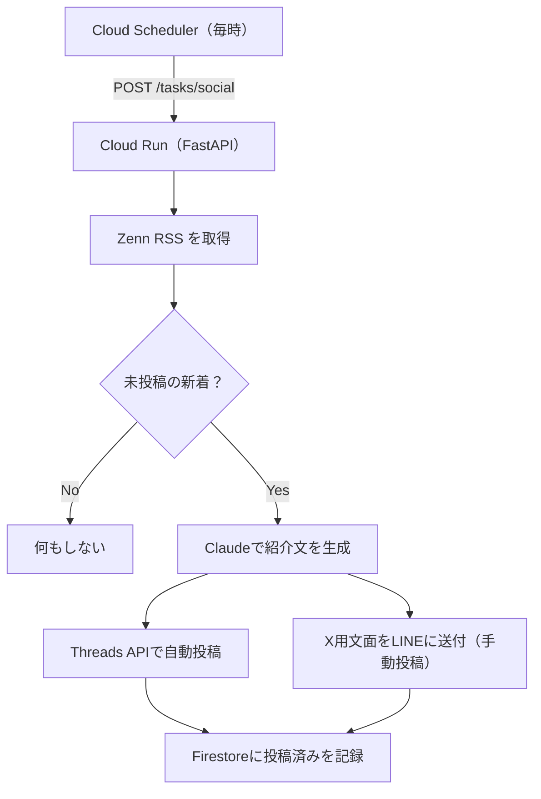

## 作ったもの

Zenn に記事を公開したら、その告知を **Threads に自動投稿**する仕組みを作った。「書く→公開→告知」のうち、最後の告知だけ毎回手作業なのが面倒だったので自動化した。

構成は Cloud Run（FastAPI）＋ Cloud Scheduler ＋ Firestore ＋ Claude という個人開発の定番スタック。Zenn の RSS を定期的に見て、新しく公開された記事を検知し、Claude で紹介文を作って Threads API で投稿する。

ついでに正直に書くと、**実装より Threads API のアクセストークン取得で一番ハマった**ので、その手順とエラーの潰し方も後半にまとめる。同じところで詰まる人は多いはず。

## なぜ X は自動化しないのか（2026年の事情）

最初は X（旧Twitter）にも自動投稿するつもりだった。が、調べてやめた。

X API は2026年2月に無料枠が新規向けに廃止され、従量課金がデフォルトになった。さらに4月の改定で、**URLを含む投稿は $0.20/件**。Zenn の告知投稿は必ず記事URLを含むので、毎回 $0.20 かかる。2本/日なら月 ~$12 で、個人の趣味の予算を簡単に超える。

一方 **Threads の公式 API は無料**。なので方針を分けた。

- **Threads**：完全自動投稿（無料）
- **X**：紹介文だけ自動生成して LINE に送り、自分でコピペ手動投稿（Webからの投稿は無料）

「できる」と「やるべき」は別、という割り切り。

## 全体構成



## トリガーは「published フラグ」ではなく RSS

公開検知をどうするか。自分は別途「下書きを1日2本ずつ公開する」スケジューラも回している（Zennのレート制限対策）。なので「フラグを true にした瞬間」をトリガーにもできる。

でもそれは使わず、**Zenn の RSS をポーリングして実際に公開された記事を見る**ことにした。理由は、Zenn のレート制限で「フラグは true だが、まだ公開されていない」状態がありうるから。**RSS に出た＝本当に公開された**ので、空振り告知を防げる。

RSS の取得は標準ライブラリだけで済む。

```python
import xml.etree.ElementTree as ET
import requests

def fetch_feed_items(username: str, limit: int = 20) -> list[dict]:
    url = f"https://zenn.dev/{username}/feed"
    resp = requests.get(url, timeout=15, headers={"User-Agent": "survey-catcher/1.0"})
    resp.raise_for_status()
    root = ET.fromstring(resp.content)

    items = []
    for item in root.iterfind(".//item"):
        title = (item.findtext("title") or "").strip()
        link = (item.findtext("link") or "").strip()
        guid = (item.findtext("guid") or link).strip()
        if link:
            items.append({"title": title, "url": link, "guid": guid})
    return items[:limit]
```

## 初回実行で過去記事を全部投稿しない工夫

ここは地味だが大事。この仕組みを初めて動かしたとき、RSS には既存の公開済み記事がずらっと並んでいる。素直に「未投稿の記事を全部投稿」すると、**過去記事が一斉に Threads に流れて大惨事**になる。

なので「**初回はシードするだけで投稿しない**」を入れた。投稿済み記録（Firestore）が空＝初回とみなし、いまフィードにある記事を全部「記録済み」にしてから終わる。投稿は次回以降の新着だけ。

```python
# 初回シード：既存記事を投稿せず記録するだけ（過去記事の一斉投稿を防ぐ）
if repo.is_empty():
    for it in items:
        repo.upsert(AnnouncedPost(id=it["guid"], url=it["url"],
                                  title=it["title"], status="seeded"))
    logger.info("social: 初回シード %d件（投稿なし）", len(items))
    return {"posted": 0, "seeded": len(items)}

# 未投稿の新着を古い順に処理
new_items = [it for it in items if not repo.exists(it["guid"])]
new_items.reverse()  # RSSは新しい順なので古い順に並べ替え
```

重複防止は Firestore に「投稿済みの guid」を持つだけ。1回の実行で投稿する本数にも上限（既定2本）を設けて、連投を防いでいる。

## Threads API は2ステップで投稿する

Threads への投稿は「コンテナを作る → 公開する」の2段階。テキスト投稿なら次の通り。

```python
BASE = "https://graph.threads.net/v1.0"

def post_text(user_id: str, access_token: str, text: str):
    # 1. メディアコンテナ作成 → creation_id
    r1 = requests.post(
        f"{BASE}/{user_id}/threads",
        data={"media_type": "TEXT", "text": text[:500], "access_token": access_token},
        timeout=20,
    )
    creation_id = r1.json().get("id")

    # 2. creation_id を指定して公開 → media_id
    r2 = requests.post(
        f"{BASE}/{user_id}/threads_publish",
        data={"creation_id": creation_id, "access_token": access_token},
        timeout=20,
    )
    return r2.json().get("id")
```

紹介文は Claude に作らせている。Threads用（500字以内）と X用（140字以内・URL込み）を1回の生成で出させ、決め打ちの区切りでパースする。月予算ガードの内側で動かすので、暴走してもコストが膨らまない。

## 一番ハマったのは実装ではなくトークン取得

ここからが本題かもしれない。Threads API の**アクセストークン取得**で延々と詰まった。同じ罠を踏む人のために、つまずきポイントを順に書く。

### 罠1：Threads App ID は Meta の App ID とは別物

OAuth の `client_id` に使うのは **Threads App ID** で、Meta アプリ共通の「App ID」**ではない**。場所もまぎらわしく、**App settings → Basic** のページに、上部の「App ID（Meta共通）」とは別に「**Threads App ID**」「**Threads App secret**」という欄がある。Meta の App ID を使うと、こうなる。

```json
{ "error": { "message": "Invalid client_id: ...", "code": 101 } }
```

:::message alert
`Invalid client_id` が出たら、まず「Threads App ID（App settings → Basic の専用欄）」を使っているか疑う。
:::

### 罠2：管理画面の「トークン生成」で出る code を使ってはいけない

ダッシュボードには「アクセストークンを生成」のようなボタンがある。ここで得られる値と、**OAuth 認可フロー（`threads.net/oauth/authorize` をブラウザで開いて得る `code`）は別物**。前者の code を token 交換に渡すと、こうなる。

```json
{ "error": { "message": "Invalid verification code", "code": 1, "error_subcode": 36006 } }
```

正しくは、認可URLをブラウザで開いて許可し、リダイレクト先URLの `?code=...#_` から **`code=` の後ろ（`#_` は含めない）** をコピーして使う。

```
https://threads.net/oauth/authorize?client_id=THREADS_APP_ID&redirect_uri=https://example.com/&scope=threads_basic,threads_content_publish&response_type=code
```

### 罠3：redirect_uri は3か所で完全一致

`Invalid verification code` は、**redirect_uri の不一致**でも出る。「認可URL」「token交換のPOST」「ダッシュボードに登録した値」の3つが、**末尾スラッシュ1文字まで**一致していないと弾かれる。地味だが効く。

### 罠4：code は1回きり・短命

認可コードは**使い捨て＆数分で失効**。token交換に失敗したら、必ず認可URLから取り直す。リダイレクト後のページをリロードしても同じ古い code のままで通らない。

これらを潰すと、ようやく token 交換が通る。

```bash
# code → 短期トークン（user_id も同時に返る）
curl -X POST https://graph.threads.net/oauth/access_token \
  -d client_id=THREADS_APP_ID -d client_secret=THREADS_APP_SECRET \
  -d grant_type=authorization_code \
  -d redirect_uri=https://example.com/ -d code="新しいcode"

# 短期 → 長期トークン（60日）
curl -s "https://graph.threads.net/v1.0/access_token?grant_type=th_exchange_token&client_secret=THREADS_APP_SECRET&access_token=短期トークン"
```

:::message
自分のアカウントに投稿するだけなら **App Review（アプリ審査）は不要**。アプリは開発モードのまま、自分をテスターに追加すれば使える。審査が要るのは他人のアカウントに代理投稿する場合だけ。
:::

長期トークンは60日で失効するので、`refresh_access_token` で更新する運用を別途用意しておく。

## まとめ

- Zenn の **RSS をポーリング**して公開を検知 → Claude で紹介文 → **Threads に自動投稿**。X はAPI料金の都合で手動（文面だけ自動生成してLINEに送る）
- **初回シード**で過去記事の一斉投稿を防ぐ。重複防止は Firestore に guid を持つだけ
- Threads API の投稿は「コンテナ作成 → publish」の2ステップ
- 詰まりどころは実装よりトークン取得。**App ID の取り違え／管理画面のcode誤用／redirect_uri不一致／codeの使い回し**の4点を潰せば通る

「公開したら告知」までを自動化できて、記事を書くこと自体に集中できるようになった。SNS連携を考えている個人開発者の参考になれば。

:::message
この記事自身も、自作の段階公開スケジューラで公開され、公開と同時にこの仕組みで Threads に告知されています。
:::
